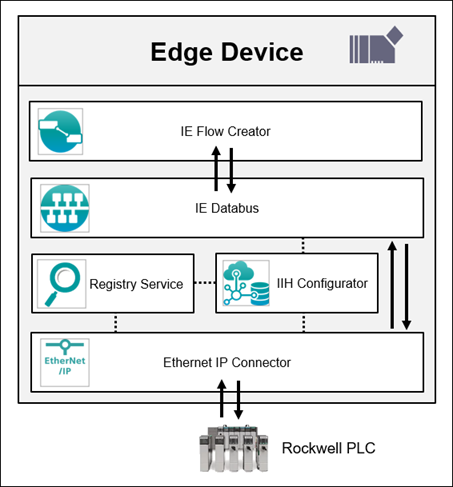

# Ethernet IP application example

This example provides a getting started guide, which shows how to use the Industrial Edge app Ethernet IP Connector.

- [Ethernet IP application example](#ethernet-ip-application-example)
  - [Description](#description)
    - [Overview](#overview)
    - [General task](#general-task)
  - [Requirements](#requirements)
    - [Prerequisites](#prerequisites)
    - [Used components](#used-components)
    - [Studio 5000 Logix Designer Project](#studio-5000-logix-designer-project)
  - [Configuration steps](#configuration-steps)
  - [Usage](#usage)
  - [Documentation](#documentation)
  - [Contribution](#contribution)
  - [Licence and Legal Information](#licence-and-legal-information)

## Description

### Overview

This application example describes how to get the data from a Rockwell PLC using the app Ethernet IP Connector with its respective configurator. The data flow goes through different applications, starting with the data acquisition. Therefore, the Ethernet IP Connector is used which writes all topics to the IE Databus. The Data Service subscribes to all those topics and stores the values in the database. Finally, the values are visualized using Performance Insight.

### General task

The example reads data from a CompactLogix Rockwell PLC using the Ethernet IP Connector. The data is published on the IE Databus. The Data Service monitors the bus and collects the shopfloor data. Therefore, the appropriate adapter for the Ethernet IP Connector must be configured in the Data Service. This data can now be used by the app Performance Insight to visualize the data. See [data-service-how-to](https://github.com/industrial-edge/data-service-configure-s7-adapter-to-collect-data) for further information regarding the Data Service.

## Requirements

### Prerequisites

- Access to an Industrial Edge Management System (IEM)
- Onboarded Industial Edge Device on IEM
- Installed System Configurator for Databus on IEM
- Installed System App Databus on Edge Device
- Installed Ethernet IP Configurator on Edge Device
- Installed Ethernet IP Connector on Edge Device
- Installed Data Service on Edge Device
- Installed Performance Insight on Edge Device
- Edge device is connected to Rockwell PLC CompactLogix5370
- Studio 5000 project loaded on PLC (e.g. for counting application)
- HTML5-capable Internet browser

### Used components

- Industrial Edge Management (IEM) V 1.2.14 (OS) V 1.2.0-36
  - IE Databus V 1.2.16
  - IE Databus Configurator V 1.2.23
  - Ethernet IP Connector V 1.1.0
  - Ethernet IP Configurator V 1.1.0
  - Data Service V 1.1.1
  - Performance Insight V 1.2.1
- Industrial Edge Device (OS) V 1.2.0-56
- Studio 5000 Logix Designer V 32.00
- CompactLogix 5370 Rev. 32.011

### Studio 5000 Logix Designer Project

The used TIA Portal project can be found in the [sources folder](./src) under the following name:

[compactlogix-demo-29042021.7z](src/compactlogix-demo-29042021.7z)

## Configuration steps

You can find further information about the following steps in the [Configuration](docs/Installation.md) documentation.

- Configure PLC Connection (Databus, EthernetIP Connector)
- Configure Configure Data Service
- Configure Performance Insight

## Usage

Once the Data Service app is configured and data is availalbe from a running Rockwell PLC, process data can be collected. Performance Insight visualizes this data and gives data insights (KPIs, metrics, etc.).

## Documentation

You can find further documentation and help in the following links

- [Industrial Edge Hub](https://iehub.eu1.edge.siemens.cloud/#/documentation)
- [Industrial Edge Forum](https://www.siemens.com/industrial-edge-forum)
- [Industrial Edge landing page](https://new.siemens.com/global/en/products/automation/topic-areas/industrial-edge/simatic-edge.html)
- [Industrial Edge GitHub page](https://github.com/industrial-edge)
  
## Contribution

Thanks for your interest in contributing. Anybody is free to report bugs, unclear documenation, and other problems regarding this repository in the Issues section or, even better, is free to propose any changes to this repository using Merge Requests.

## Licence and Legal Information

Please read the [Legal information](LICENSE.md).
