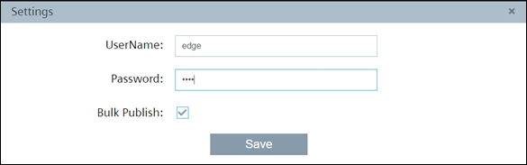

# Configuration

- [Configuration](#configuration)
  - [Configure PLC Connection](#configure-plc-connection)
    - [Configure Databus](#configure-databus)
    - [Configure Ethernet IP Connector](#configure-ethernet-ip-connector)
  - [Configure Data Service](#configure-data-service)
  - [Configure Performance Insight](#configure-performance-insight)

## Configure PLC Connection

To read data from a Rockwell PLC and provide the data, we will use the Ethernet IP Connector to establish a connection with the PLC.
The Ethernet IP Connector sends data to the Databus from where the Data Service can collect and save the needed values.
In order to build this infrastructure, these apps must be configured properly:

- Databus
- Ethernet IP Connector

### Configure Databus

The system app Databus is essential to exchange data between a PLC and the Industrial Edge Device.

- Open the Industrial Edge Management web interface
- Go to "Data Connections" > IE Databus
- Select the corresponding Industrial Edge Device
- Create a new user with username and password and give the user publish and subscribe permission
- Create this topic `"ie/#"`
- Deploy the databus configuration and wait for the job to be finished successfully

### Configure Ethernet IP Connector

To use the app Ethernet IP Connector properly (which has no web ui), the corresponding app Ethernet IP Configurator is necessary.
Here the connection to the Rockwell PLC can be configured.

- Open the Industrial Edge Device web interface
- Make sure that the app Ethernet IP Connector is running
- Open the app Ethernet IP Configurator
- Add the Rockwell PLC as data source

- Configure the user settings
  

- Add all needed tags

- Deploy the configuration
- Start the project

## Configure Data Service

The app Data Service collects the data out of the Ethernet IP Connector and stores it for a defined time period.
This is a prerequisite for other apps like Performance Insight.

- Open the Industrial Edge Device web interface
- Open the app Data Service
- Go to the adapter settings and select "Ethernet IP Connector"
- Enter the username and password for the databus user
- Activate the adapter

- Go to the assets view and add new variables for data, comming from the Ethernet IP Connector

## Configure Performance Insight

The app Performance Insight is used to visualize the data comming from the Rockwell PLC.

- Open the app Performance Insight
- In the view "My Plant", create a new dashboard
- Add a new widget "Value" for the parameter `floaty`
- Add a new widget "Diagram" for the parameter `counter`

